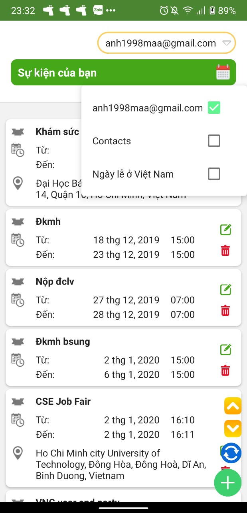
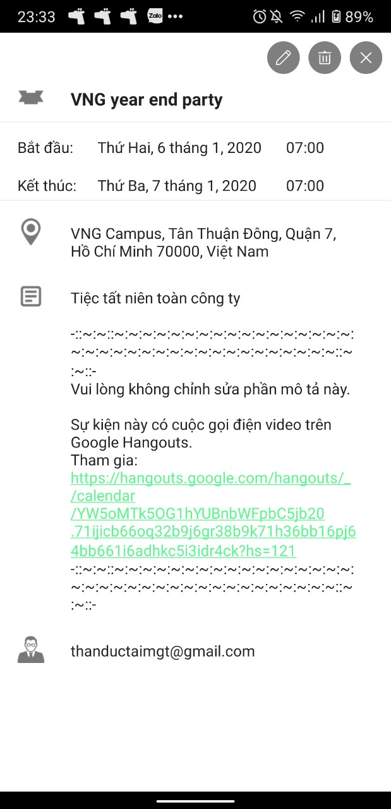
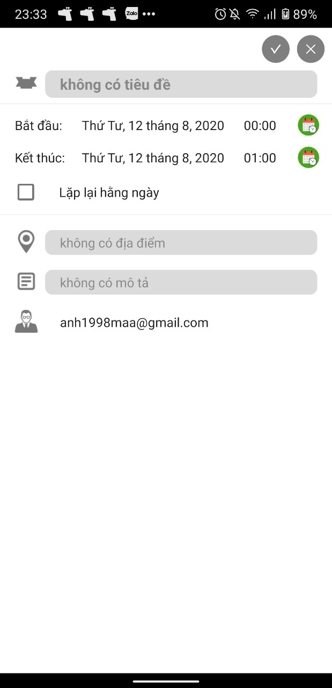

# Events Manager

**An Android app for managing events**

## Features

* Create, edit and delete events which will be reminded by notifications
* Synchronize with Google Calendar (as store events in system Calendar Provider database)

## Install

* Clone this repo:
```bash
git clone https://github.com/thanductaimgt/EventsManager.git
```

* Download APK [here](app/release/EventsManager.apk)

## Screenshots

</br>
<div align="center">
   <table align="center" border="0" >
  <tr>
    <td>

       <td>
    </td>
     <td> </td>
  </table>
  </div>
</br>

## Author

**Tai Than**
* Github: [thanductaimgt](https://github.com/thanductaimgt)
* LinkedIn: [Tai Than Duc](https://www.linkedin.com/in/tai-than-duc-900603169/)
* Email: thanductaimgt@gmail.com

## License
[MIT](https://choosealicense.com/licenses/mit/)

## Acknowledgments
* Thank you [dtrung98](https://github.com/dtrung98) for this README template =)